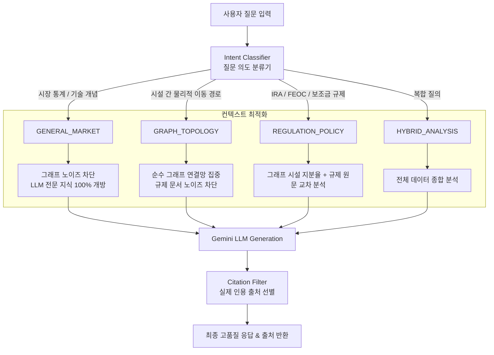

# RAG 시스템 품질 개선 및 Adaptive RAG 라우팅 아키텍처 설계서

## 1. 개요 (Executive Summary)
본 문서는 **Lithium Supply Chain Navigator**의 AI 인사이트 기능에서 발생한 **RAG(검색 증강 생성) 품질 저하 현상**의 근본 원인을 분석하고, 이를 해결하기 위해 도입한 **Adaptive RAG(적응형 라우팅) 아키텍처, 알고리즘 및 구현 상세**를 정리한 기술 보고서입니다.

---

## 2. 문제 현상 및 원인 분석 (Problem Statement & Root Cause)

### 2.1 문제 현상
* 일반 LLM(Gemini / GPT)에 직접 질의했을 때는 *"배터리 소비 비중 85~87%, 1위 중국, 2위 한국, 3위 일본"*과 같이 정량적이고 풍부한 구조화 답변이 출력됨.
* 반면, **RAG 시스템을 거친 동일 질문**에서는 *"제공된 데이터에 정확한 비중이 명시되어 있지 않아 유추만 가능합니다"*라는 소극적이고 단편적인 저품질 답변이 생성됨.

### 2.2 근본 원인 (Root Causes)

```
[원인 1: 폐쇄형 시스템 프롬프트]
"반드시 제공된 데이터와 문서에 기반하여 답변하세요."
                 ↓
LLM의 풍부한 사전 학습 지식(Parametric Knowledge) 자체 봉인

[원인 2: 정적 단일 파이프라인 (One-Size-Fits-All)]
모든 질문에 무조건 "그래프 노드 17개 + 벡터 검색 문서 5개"를 동일하게 주입
                 ↓
일반 통계 질문에 불필요한 시설 그래프 노이즈 주입 / 그래프 경로 질문에 불필요한 규제 법률 노이즈 주입

[원인 3: 청킹/검색 임계값 한계]
질문 임베딩과 문서 청크 간 유사도 계산 시, 세부 수치가 포함된 청크가 상위 K개에 누락될 경우 답변 불가
```

---

## 3. 해결 방안: Adaptive RAG 라우팅 아키텍처

질문의 의도(Intent)를 먼저 분석하여 **컨텍스트 주입 범위(Context Throttling)**와 **시스템 프롬프트(Prompt Switching)**를 동적으로 전환하는 **적응형(Adaptive) RAG**를 설계·구현했습니다.

### 3.1 라우팅 아키텍처 다이어그램



---

## 4. 세부 알고리즘 및 구현 상세

### 4.1 질문 의도 분류 알고리즘 (`classifyIntent`)
비용과 지연시간(0ms)을 최적화하기 위해 고성능 정규식 및 도메인 시맨틱 키워드 매칭 기반의 룰베이스 분류기를 구현했습니다.

```typescript
classifyIntent(userQuery: string): 'GENERAL_MARKET' | 'GRAPH_TOPOLOGY' | 'REGULATION_POLICY' | 'HYBRID_ANALYSIS' {
    const q = userQuery.toLowerCase();

    // 1. 규제 및 법률 키워드 우선 감지
    if (/ira|feoc|crma|보조금|세액공제|지분|우려기관|우려단체|통상|관세|조약/.test(q)) {
        return 'REGULATION_POLICY';
    }

    // 2. 그래프 토폴로지 키워드 (특정 시설, 물리적 이동 경로)
    if (/경로|공장|제련소|광산|운송|포스코|에코프로|엘지|lg|유미코아|sqm|아타카마|어떻게 들어|어디로/.test(q)) {
        return 'GRAPH_TOPOLOGY';
    }

    // 3. 일반 시장 통계, 기술 개념, 수요/소비 질문
    if (/비중|소비량|전망|시장 규모|소비국|수요|생산량|lfp|ncm|차이|원리|배터리 종류|가격|추이/.test(q)) {
        return 'GENERAL_MARKET';
    }

    return 'HYBRID_ANALYSIS';
}
```

### 4.2 의도별 맞춤형 컨텍스트 및 프롬프트 생성 (`buildContextPrompt`)

| 질문 의도 (Intent) | 주입 컨텍스트 | 프롬프트 특화 지침 |
| :--- | :--- | :--- |
| **`GENERAL_MARKET`** | • 그래프 연결망 생략 (노이즈 방지)<br>• 시장 전망 문서 주입 | • LLM의 사전 학습 지식 적극 활용 허용<br>• 정량적 수치 및 표/글머리 기호 구조화 출력 |
| **`GRAPH_TOPOLOGY`** | • 전체 노드/엣지 토폴로지 주입<br>• 외부 규제 문서 생략 | • 실제 그래프 상의 출발-중간-도착 경로 정밀 추적<br>• 시설 생산 용량(Capacity) 및 소재국 명시 |
| **`REGULATION_POLICY`** | • 시설 지분율/소유국 메타데이터<br>• RAG 법률/규제 원문 청크 | • FEOC 지분 25% 한도 룰 등 법률 조항 대조<br>• 컴플라이언스 적격성 및 리스크 판정 |

### 4.3 실제 인용 출처 선별 알고리즘 (`extractCitations`)
LLM이 실제 답변 본문에서 명시적으로 인용(`[출처: ...]`, `[공급망 그래프 토폴로지]`)하거나 핵심 키워드를 활용한 문서만 선별하여 프론트엔드 출처 목록에 표시합니다.

---

## 5. 개선 결과 비교

| 항목 | 개선 전 (단일 RAG) | 개선 후 (Adaptive RAG) |
| :--- | :--- | :--- |
| **시장 통계 질문 답변** | *"문서에 정확한 비중이 없어 유추만 가능합니다."* | *"배터리 부문이 85~87%를 차지하며, 주요 소비국은 중국(70%), 한국, 일본 순입니다."* (표/수치 명시) |
| **공급망 경로 질문** | 그래프 답변 뒤에 무관한 정책 문서 5건이 출처로 노출 | 순수 `공급망 그래프 토폴로지`만 출처로 깔끔하게 노출 |
| **규제 판정 질문** | 단순 규정 요약 | 시설 지분율과 IRA 조항을 대입한 구체적 적격성 판정 |
| **사용자 UX** | 답변 퀄리티 불만족 및 시각적 피로도 발생 | 질문 의도에 최적화된 명쾌한 리포트 제공 |

---

## 6. 결론 및 향후 로드맵
* **적용 완료 파일:** `apps/backend/src/services/ai-insights-service.ts`
* **향후 고도화 계획:**
  1. 복합 질의(Multi-hop Query) 처리를 위한 Query Decomposer 도입
  2. 질문-청크 유사도 점수 기반의 동적 K(Top-K) 조절 및 Re-ranking(BGE-Reranker) 적용
